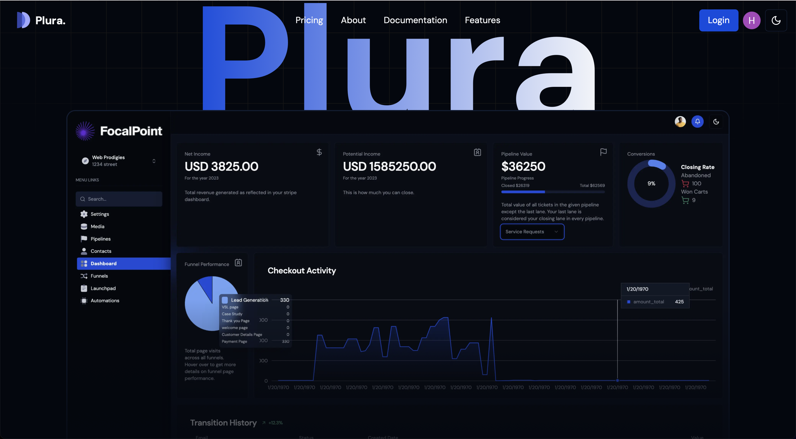
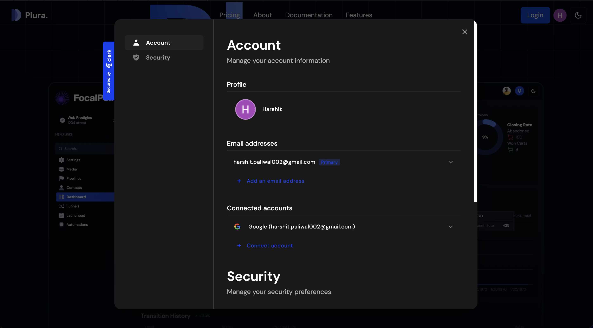
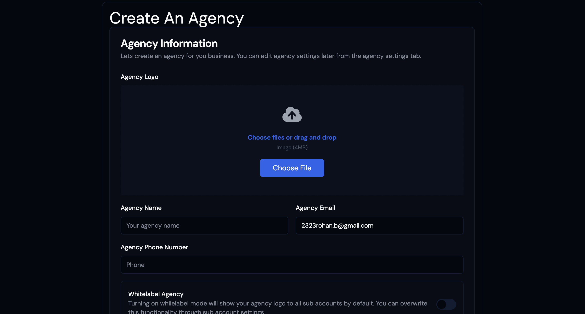
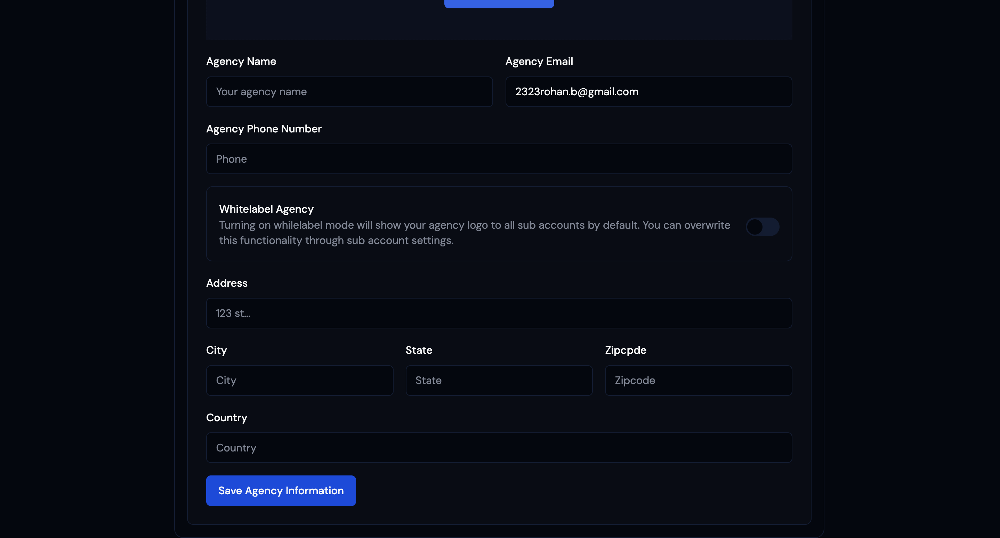
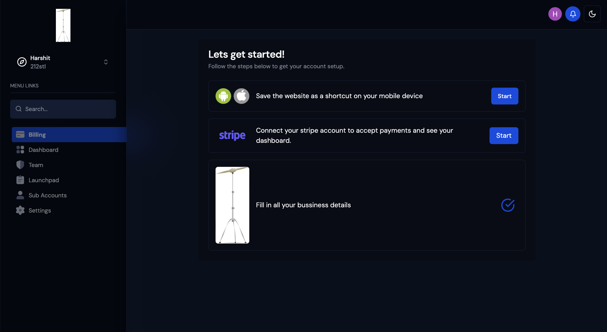
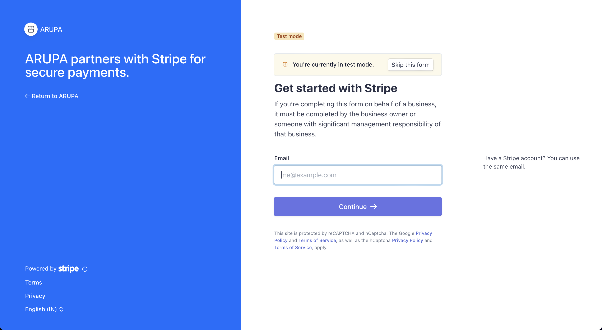
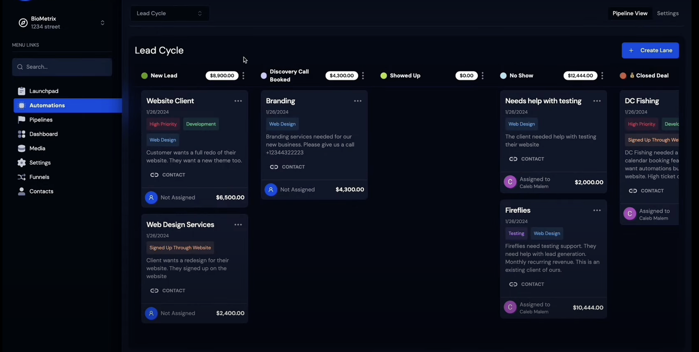
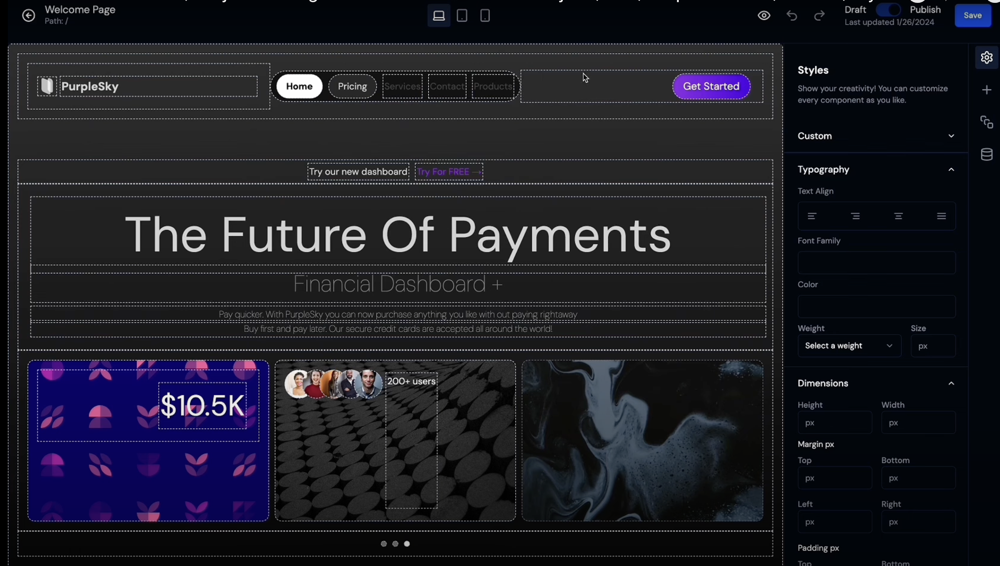

# PLURA - SaaS Website Builder

<div align="center">
  
  <p align="center">Home Page</p>
  
  <p align="center">Account Page</p>
  
  <p align="center">Create Agency</p>
  
  <p align="center">Create Agency</p>
  
  <p align="center">Agency Owner Dashboard</p>
  
  <p align="center">Stripe Conect</p>
  
  <p align="center">Agency Subaccount Dashboard</p>
  
  <p align="center">Build your website</p>
</div>


## Getting Started

First, run the development server:

```bash
npm run dev
# or
yarn dev
# or
pnpm dev
# or
bun dev
```

### Features in this application.
- 🤯 Multivendor B2B2B Saas
- 🏢 Agency and Sub accounts
- 🌐 Unlimited funnel hosting
- 🚀 Full Website & Funnel builder
- 💻 Role-based Access
- 🔄 Stripe Subscription plans
- 🛒Stripe add-on products
- 🔐 Connect Stripe accounts for all users! - Stripe Connect
- 💳 Charge application fee per sale and recurring sales
- 💰 Custom Dashboards
- 📊 Media Storage
- 📈 Stripe Product Sync
- 📌Custom checkouts on funnels
- 📢 Get leads from funnels
- 🎨 Khanban board
- 📂 Project management system
- 🔗 Notifications
- 📆 Funnel performance metrics
- 🧾 Agency and subacc metrics
- 🌙 Graphs and charts
- ☀️ Light & Dark mode
- 📄 Functioning landing page

### Techs used.
- Nextjs14 
- Stripe Connect
- Prisma
- MySQL
- TailwindCSS
- Clerk
- Shadcn/UI
- Zod
- Khanban board
- and many more


## Website with background grids
[ibelick](https://bg.ibelick.com/)

